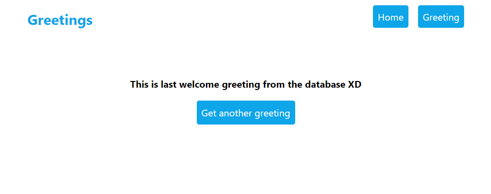

# Hello Rails React App

> Hello Rails React app is simple application that contains setup of rails and react in one application. The greeting page loads a random greeting from database on every page load.

## Preview

### Home Page


### Greeting Page



## Built With

- Major languages (Ruby)
- Framworks (Ruby on Rails)
- Javascript (ReactJS)
- Markup (HTML)
- Styles (CSS, Tailwind)

## Live version

- Visit [Recipe-App]()

## Getting Started

To get a local copy up and running follow these simple example steps.

### Prerequisites
- A text editor(preferably Visual Studio Code)

### Install
- Ruby
- Ruby on Rails
- PostgresSQL
- Node

### Using it Locally

- Clone the project

```
git clone git@github.com:thecodechaser/hello-rails-react.git

cd hello-rails-react

```

### Setup

Install gems with:

```
bundle install
```

Setup database with:

```
rails db:create
rails db:migrate
```

Install dependencies

```
npm i 
or
npm install
```

### Usage

Start server with:

```
rails server
```

Visit http://localhost:3000/ in your browser.

### Open API documentation

```
Coming soon!
```


## Visit And Open Files

[Visit Repo](https://github.com/thecodechaser/hello-rails-react)

## Download Repo

[Download Repo](https://github.com/thecodechaser/hello-rails-react/archive/refs/heads/main.zip)


## Authors

👤 **Ranjeet Singh**

- GitHub: [@thecodechaser](https://github.com/thecodechaser)
- Twitter: [@thecodechaser](https://twitter.com/thecodechaser)
- LinkedIn: [thecodechaser](https://linkedin.com/in/thecodechaser)

## 🤝 Contributing

Contributions, issues, and feature requests are welcome!

Feel free to check the [issues page](https://github.com/thecodechaser/hello-rails-react/issues).

## Show your support

Give a ⭐️ if you like this project!

## Acknowledgments

- Inspiration: Microverse

## 📝 License

This project is [MIT](./LICENSE.md) licensed.
